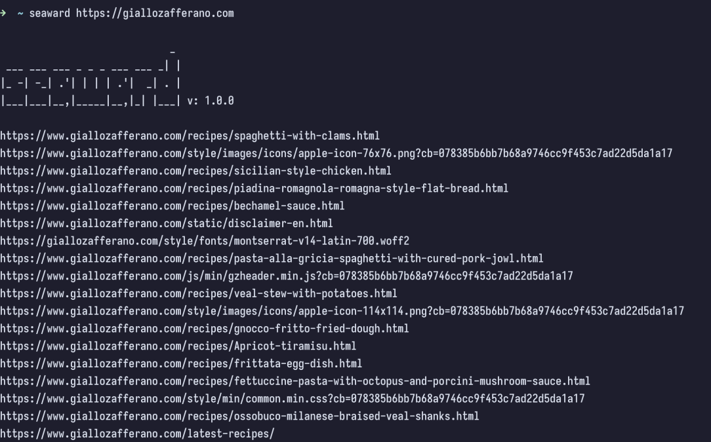
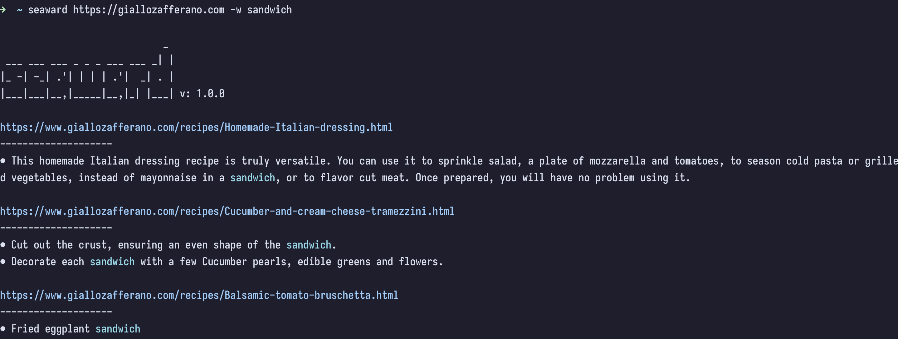

# 🌊 seaward


### Installation
``` console
cargo install seaward
```

## NetBSD
On NetBSD a pre-compiled binary is available from the official repositories. To install it, simply run:
``` console
pkgin install seaward
```

## Overview
Seaward is used to discover every link on a web page (and its linked pages) without duplicates or to search for a word starting from the given URL.

If you want to save the links inside a file, you can run `seaward <URL> --silent > file.txt`, and if you experience many timeout errors try using a higher timeout with `-t`.
With the `-d 0` option you crawl only the web page passed in the `<URL>` parameter, with `-d 1` also the pages linked to it (always within the same web site) and so on.

## Usage

``` console
seaward -h
```
This will display every option.

``` console
seaward: 1.0.0

seaward is a crawler which searches for links or a specified word in a website.
Use -h for short descriptions and --help for more details.

Project home page: https://github.com/M3nny/seaward


Usage: seaward [OPTIONS] <URL>

Arguments:
  <URL>  Base url to start with.

Options:
  -w, --word <WORD>    Case insensitive word to search.
  -d, --depth <DEPTH>  Set how many times a link has to be followed.
      --silent         Display output only.
  -h, --help           Print help (see more with '--help')
  -V, --version        Print version

Timeout:
  -t, --timeout <TIMEOUT>  Set a request timeout in seconds (default: 3s).
      --warmup <WARMUP>    Set how many requests to make to find the best timeout automatically.
```

### Examples



